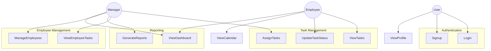
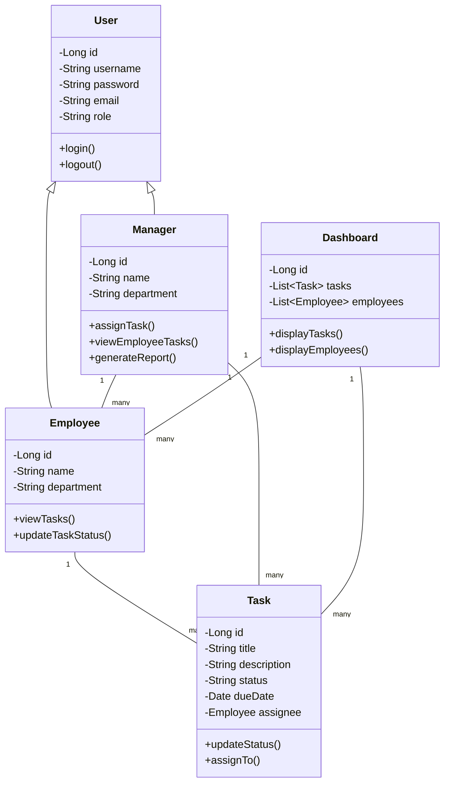

# TaskFlow Task Management System

A comprehensive task management system built with Spring Boot microservices backend and a responsive HTML/CSS/JavaScript frontend.

## Features

- User Authentication and Authorization
- Task Management
- Employee Management
- Calendar Integration
- Dashboard for both Employees and Managers
- Profile Management
- Task Assignment and Tracking

## Technology Stack

- Frontend: HTML, CSS, JavaScript
- Backend: Java Spring Boot
- Database: MySQL
- Build Tool: Maven

## Project Structure

- `/taskflow-backend/` - Backend microservices:
  - `/user-service/` - Handles user authentication and user management
  - `/task-service/` - Handles task creation, assignment and management
- Frontend files in root directory:
  - HTML files
  - `/js/` - JavaScript files
  - `/css/` - CSS styles
  - `/images/` - Image assets

## Backend Microservices

The backend is split into two separate microservices:

1. **User Service** (Port 8081): Handles user management, authentication, and authorization
2. **Task Service** (Port 8082): Handles task creation, assignment, and tracking

Each service has its own:
- Database connections (to the same shared database)
- REST API endpoints
- Business logic
- Configuration

## Frontend

The frontend is a responsive web application built with:
- HTML5
- CSS3 with Bootstrap 5
- JavaScript (vanilla)

Key features:
- Manager and employee dashboards
- Task creation and management
- Task assignment to employees
- User profiles and management
- Authentication with JWT

## How to Run the Application

### Backend

Start both microservices:

```bash
# Start the User Service
cd taskflow-backend/user-service
mvn spring-boot:run

# In a separate terminal, start the Task Service
cd taskflow-backend/task-service
mvn spring-boot:run
```

### Frontend

Simply open any of the HTML files in your browser, or serve them using a local web server:

```bash
# Using Python's built-in HTTP server
python -m http.server 8000

# Or with Node.js http-server (install with: npm install -g http-server)
http-server
```

Then open your browser to http://localhost:8000 (or whatever port your server is using).

## Connecting Frontend with Microservices

The frontend connects to the backend microservices through REST API calls. The connection configuration is defined in the `js/config.js` file.

Key points:
- User Service runs on port 8081
- Task Service runs on port 8082
- API paths are defined in the config file
- JWT tokens are used for authentication

Login credentials (for development):
- Manager: admin@example.com / password
- Employee: employee@example.com / password

## Future Improvements

- Add Eureka Service Registry for service discovery
- Implement Spring Cloud Gateway
- Add circuit breakers and fallbacks for improved resilience
- Containerize with Docker and orchestrate with Kubernetes

## Use Case Diagram



## Class Diagram



## Setup Instructions

1. Clone the repository
2. Set up the backend:
   ```bash
   cd taskflow-backend
   mvn clean install
   mvn spring-boot:run
   ```
3. Open the frontend files in your preferred web browser

## Screenshots


