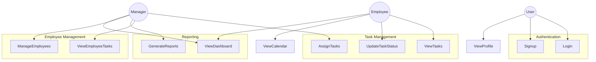
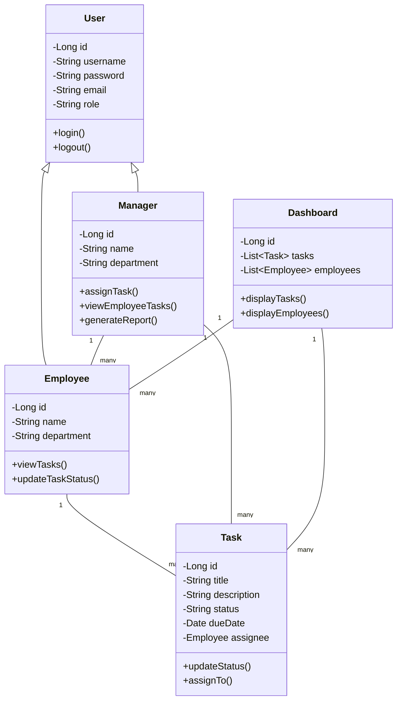

# Task Manager Application

A comprehensive task management system that helps organizations manage and track tasks efficiently. The application provides features for both employees and managers to handle task assignments, tracking, and reporting.

## Features

- User Authentication and Authorization
- Task Management
- Employee Management
- Calendar Integration
- Dashboard for both Employees and Managers
- Profile Management
- Task Assignment and Tracking

## Technology Stack

- Frontend: HTML, CSS, JavaScript
- Backend: Java Spring Boot
- Database: (To be specified)
- Build Tool: Maven

## Project Structure

```
TaskManager/
├── taskflow-backend/     # Spring Boot Backend
├── css/                  # Stylesheets
├── js/                   # JavaScript files
├── images/              # Static images
└── templates/           # HTML templates
```

## Use Case Diagram



## Class Diagram



## Setup Instructions

1. Clone the repository
2. Set up the backend:
   ```bash
   cd taskflow-backend
   mvn clean install
   mvn spring-boot:run
   ```
3. Open the frontend files in your preferred web browser

## Contributing

1. Fork the repository
2. Create your feature branch
3. Commit your changes
4. Push to the branch
5. Create a new Pull Request

## License

This project is licensed under the MIT License - see the LICENSE file for details. 